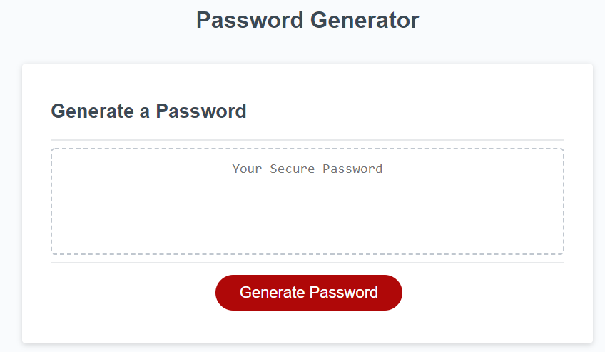

  
# Password Generator 

## Description

This repository contains the code base used in creating the password generator web app. Essentially, by entering a few parameters, the user can receive a randomly generated password. 

## App

The password generator app can be found [here](https://nnavarr.github.io/password-generator/).

## Usage
1. Click the 'Generate Password' button
2. Follow the prompts
3. Copy the generated password

